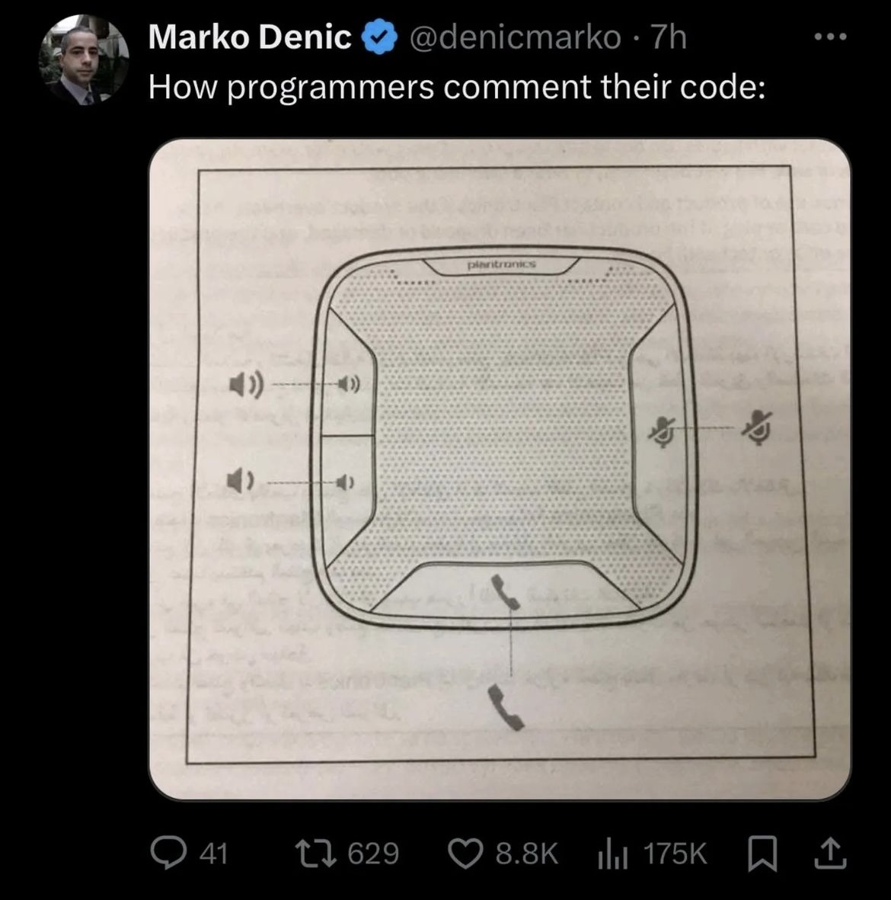

# Clean Code Summary

>"Clean code always looks like it was written by someone who cares."

\- Michael Feathers

## Table of contents

- [Chapter 1 - Clean Code](#chapter1)
- [Chapter 2 - Meaningful Names](#chapter2)
- [Chapter 3 - Functions](#chapter3)
- [Chapter 4 - Comments](#chapter4)
- [Chapter 5 - Formatting](#chapter5)
- [Chapter 6 - Objects and Data Structures](#chapter6)
- [Chapter 7 - Error Handling](#chapter7)
- [Chapter 8 - Boundaries](#chapter8)
- [Chapter 9 - Unit Tests](#chapter9)
- [Chapter 10 - Classes](#chapter10)
- [Chapter 11 - Systems](#chapter11)
- [Chapter 12 - Emergence](#chapter12)
- [Chapter 13 - Concurrency](#chapter13)
- [Chapter 14 - Successive Refinement](#chapter14)
- [Chapter 15 - JUnit Internals](#chapter15)
- [Chapter 16 - Refactoring SerialDate](#chapter16)
- [Chapter 17 - Smells and Heuristics](#chapter17)


<a name="chapter1">
<h1>Chapter 1 -  Clean Code</h1>
</a>

This book focuses on the art of programming. More precisely, how to write excellent code and how to improve bad code. Code reflects the details and requirements that can't be overlooked or simplified. While we can develop languages that align more closely with these requirements and create tools to help us organize these requirements into structured formats, the precision will always be needed. Your produced work should be craftsmanship, something you can be proud of.

Why would you resort to bad code?
* Are you dealing with time pressure?
* Are you trying to speed through your task?
* Did you not have time to do a good job?
* Are you exhausted of working in the same program or module?
* Is your boss rushing you?

If you ever think, "I'll fix it later," remember LeBlanc's Law: "Later equals never."

As a professional, the quality of your code is your responsibility. Consider this scenario:

> What if you were a doctor and had a patient who demanded that you stop all the silly hand-washing in preparation for surgery because it was taking too much time? Clearly the patient is the boss; and yet the doctor should absolutely refuse to comply. Why? Because the doctor knows more than the patient about the risks of disease and infection. It would be unprofessional (never mind criminal) for the doctor to comply with the patient.

Often, the drive to meet deadlines might tempt you to cut corners. Managers might not understand the risk of making a mess and underestimate tech debt. However, the only way to go fast is to consistently keep the code as clean as possible.

### Defining Clean Code

Each experienced programmer has their own definition of clean code, but all of them agree on the following: Clean code is code that you can read easily. It is code that has been taken care of.

In the book, Uncle Bob also explains: 

> Consider this book a description of the Object Mentor School of Clean Code. The techniques and teachings within are the way that we practice our art. We are willing to claim that if you follow these teachings, you will enjoy the benefits that we have enjoyed, and you will learn to write code that is clean and professional. But don’t make the mistake of thinking that we are somehow “right” in any absolute sense. There are other schools and other masters that have just as much claim to professionalism as we. It would behoove you to learn from them as well.

### The boy scout rule

Writing code well is just the beginning. To prevent the inevitable decay over time, code must be actively maintained. The Boy Scout Rule states: 

> "Always leave the campground cleaner than you found it."

This principle applies directly to coding: always improve the code whenever possible, ensuring it remains robust and clean for the future.


<a name="chapter2">
<h1>Chapter 2 -  Meaningful Names</h1>
</a>

Names can be found in every aspect of software development, affecting files, directories, variables, functions, and more. Because of their dominant presence, we better name them well.

## Use Intention-Revealing Names

Names should be descriptive enough to reveal why they exist, what they do, and how they should be used without needing additional comments.

| Does not reveal intention        | Reveals intention       |
| -------------------------------- | ----------------------- |
| `int d; // elapsed time in days` | `int elapsedTimeInDays` |


Proper naming enhances code clarity and maintainability.

```java
public List<int[]> getThem() {
  List<int[]> list1 = new ArrayList<int[]>();
  for (int[] x : theList)
    if (x[0] == 4)
      list1.add(x);
  return list1;
}
```

This code is simple, but there are many things uncertain:

1. What is the content of `theList`?
2. Why is `x[0]` significant in the list?
3. Why do we compare `x[0]` to `4`?
4. How would I use the returned list?

These questions cannot be solved by looking at the code above, but they should've been. Let's say we're working on a mine sweeper game. The previous code can be refactored into this:

```java
public List<int[]> getFlaggedCells() {
  List<int[]> flaggedCells = new ArrayList<int[]>();
  for (int[] cell : gameBoard)
    if (cell[STATUS_VALUE] == FLAGGED)
      flaggedCells.add(cell);
  return flaggedCells;
}
```

The simplicity of the code has not changed, but the code has become much more explicit. Further improvement involves using a class to encapsulate cell properties:

```java
public List<Cell> getFlaggedCells() {
  List<Cell> flaggedCells = new ArrayList<Cell>();
  for (Cell cell : gameBoard)
    if (cell.isFlagged())
      flaggedCells.add(cell);
  return flaggedCells;
}
```

## Avoid Disinformation

Avoid misleading terms that could confuse the reader. For example, do not use `accountList` unless it's actually a List. If the container holding the accounts is not actually a List, it may lead to confusion. So `accountGroup` or `bunchOfAccounts` or just plain `accounts` would be better.

Also, avoid subtle naming differences that are easily confused. E.g. the difference between a `XYZControllerForEfficientHandlingOfStrings` in one module, and `XYZControllerForEfficientStorageOfStrings` in another module is way too hard to distinguish.

## Make Meaningful Distinctions

Avoid arbitrary distinctions in names. Instead, choose names that convey meaning. 

```java
public static void copyChars(char a1[], char a2[]) {
  for (int i = 0; i < a1.length; i++) {
    a2[i] = a1[i];
  }
}
```

We can improve the code selecting more explicit argument names:

```java
public static void copyChars(char source[], char destination[]) {
  for (int i = 0; i < source.length; i++) {
    destination[i] = source[i];
  }
}
```

Noise words are another meaningless distinction. Imagine that you have a Product class. If you have another called `ProductInfo` or `ProductData`, you have made the names different without making them mean anything different. Info and Data are indistinct noise words like `a`, `an`, and `the`.

Noise words are redundant. The word `variable` should never appear in a variable name. The word `table` should never appear in a table name.

## Use Pronounceable Names

Names should be easily pronounceable, as this helps in communication among developers. For instance, rename `genymdhms` (Generation date, year, month, day, hour, minute and second) to `generationTimestamp`.

## Use Searchable Names

Prefer searchable names over cryptic single-letter names or numeric constants.

## Avoid Encoding

Avoid unnecessary encodings in names, like the [Hungarian Notation](https://en.wikipedia.org/wiki/Hungarian_notation), which could complicate understanding.

Encoding type or scope information into names simply adds an extra burden of deciphering. Also, they are easy to mistype and hard to pronounce.

## Interfaces and Implementations

Say you are building an abstract Factory for the creation of shapes. This factory will be an interface and will be implemented by a concrete class. What should we name them? `IShapeFactory` and `ShapeFactory`? According to Uncle Bob, we should leave interfaces' names untouched. We don’t want our users knowing that we're handing them an interface. We just want them to know that it’s a `ShapeFactory`. So if we must encode either the interface or the implementation, we better encode the implementation. E.g. calling it `ShapeFactoryImp`.

## Class and Method Names

Class names should be nouns or noun phrases, such as `Customer` or `WikiPage`, and not vague or generic like `Manager`. Methods should have verb or verb phrase names like `postPayment` or `deletePage`.

## Don't Be Cute

| Cute name         | Clean name    |
| ----------------- | ------------- |
| `holyHandGranade` | `deleteItems` |
| `whack`           | `kill`        |
| `eatMyShorts`     | `abort`       |

## Consistency in Concept Names

Maintain consistency in naming; don’t mix `fetch`, `retrieve`, and `get` for similar operations across different classes.

## Don’t Pun

Avoid using the same term for different purposes across your codebase to prevent confusion. For instance, rather than using `add` in multiple contexts, opt for `insert` or `append` when adding elements to a collection, distinguishing it from mathematical addition.

## Use Solution Domain Names

Use terminology from computer science, such as algorithms, pattern names, and technical terms, when naming elements in your code. This aligns with the expected knowledge base of other programmers.

## Use Problem Domain Names

When technical terms are not enough, use terminology from the problem domain. This approach helps future maintainers of the code, who can ask domain experts for clarification.

## Add Meaningful Context

Names are often not self-explanatory; provide context through logical structuring or prefixing when necessary. For example, `addrState` is clearer than `state` when viewed outside of an `Address` class. Creating a dedicated class often would solve this issue more elegantly, of course.

## Don’t Add Gratuitous Context

Avoid overloading names with unnecessary context. For example, prefixing every class name with `GSD` in an application named “Gas Station Deluxe” is redundant. Choose clarity and brevity in naming to enhance code readability.


<a name="chapter3">
<h1>Chapter 3 -  Functions</h1>
</a>

## Keep Functions Small

Functions should be concise. This also applies to blocks within structures like `if`, `else`, and `while` statements, which ideally should contain a single line, usually a function call. This approach not only keeps the function small (and also restricts the amount of indent levels) but also enhances its documentary value through the descriptive names.

## Do One Thing

> FUNCTIONS SHOULD DO ONE THING. THEY SHOULD DO IT WELL. THEY SHOULD DO IT ONLY.

 If a function is divided into sections such as _declarations_ and _initialization_, it likely does more than one thing, which is not recommended.

## One Level of Abstraction per Function

To ensure functions do one thing, all statements within them should operate at the same level of abstraction, ideally allowing the code to read like a narrative, moving smoothly from top to bottom without weird transitions.

## Switch Statements

Switch statements by their nature do multiple things, making them larger than desired for a single block or function. If we truly need to use them, they should be encapsulated in a low-level class and managed via polymorphism to avoid repetition.

## Use Descriptive Names

> You know you are working on clean code when each routine turns out to be pretty much what you expected.

Good names make functions understandable and hint at what the function does without needing to dive into its details. Don't shy away from longer descriptive names, they are preferable to cryptic short ones. And a long descriptive name is better than a long descriptive comment.

## Function Arguments

The fewer the arguments a function has, the better. Functions should ideally take zero arguments. More than three arguments complicate both understanding and testing of the function. Also, avoid output arguments as they can confuse the reader about the direction of data flow.

### Flag Arguments

Usage is not recommended as it ensures that a function does more than one thing. It does one thing if the flag is `true` and another if the flag is `false`! 

### Argument Objects

When having multiple arguments that always belong together (in this case cartesian coordinates), figure out if those arguments belong to a broader idea.

```java
Circle makeCircle(double x, double y, double radius);
```
 Often the arguments can be enveloped into a class:

```java
Circle makeCircle(Point center, double radius);
```

### Argument Lists

Functions can accept a variable number of arguments, similar to:

```java
String.format("%s worked %.2f hours.", name, hours)
```

When variable arguments are treated identically, they function like a single list argument. For example, `String.format` is effectively dyadic (has only two arguments):

```java
public String format(String format, Object... args)
```

Thus, functions with variable arguments should follow the same rules as other functions and should be limited to monads, dyads, or triads to maintain simplicity and clarity:

```java
void monad(Integer... args);
void dyad(String name, Integer... args);
void triad(String name, int count, Integer... args);
```

### Verbs and Keywords

In the case of a monad, the function and argument should form a very nice verb/noun pair. For example, `write(name)` is very obvious. Whatever this “name” thing is, it is being “written.” An even better name might be `writeField(name)` , which tells us that the "name" thing is a "field".

## Command Query Separation

Functions should either do something or answer something, but not both. Either your function should change the state of an object, or it should return some information about that object. Doing both often leads to confusion.

Here's an example of how it should not be done:

```java
public String updateUserAndGetName(User user, String newName) {
    if (user != null && newName != null && !newName.isEmpty()) {
        user.setName(newName); // Command
        return user.getName(); // Query
    } else {
        return "Update failed";}
}
```

A better way would be to split this up into two functions:

```java
// Command
public void renameUser(User user, String newName) {
    if (user == null) {
        throw new IllegalArgumentException("User cannot be null.");
    }
    if (newName == null || newName.isEmpty()) {
        throw new IllegalArgumentException("New name cannot be null or empty.");
    }
    user.setName(newName);
}

// Query
public String getUserName(User user) {
    if (user == null) {
        throw new IllegalArgumentException("User cannot be null.");
    }
    return user.getName();
}

```

## Prefer Exceptions to Returning Error Codes

Using exceptions instead of returning error codes from functions helps maintain clear command-query separation, enhancing code clarity and error handling.

## Don't Repeat Yourself (DRY)

Avoiding duplication is crucial in software development. Adhering to the DRY principle helps reduce maintenance issues and improves code readability and scalability.

## Structured Programming

Edsger Dijkstra's structured programming advocates for each function and block within a function to have one entry and one exit. This typically means using only one return statement, and avoiding `break`, `continue`, and `goto` statements, especially in larger functions where such discipline greatly enhances readability and control flow.

However, in small functions, using multiple `return`, `break`, or `continue` statements can be acceptable and even preferable for clarity and expressiveness. The `goto` statement, however, should still be avoided.


<a name="chapter4">
<h1>Chapter 4 -  Comments</h1>
</a>

Well-placed comments can be highly beneficial, enhancing understanding of code modules. Conversely, unnecessary or outdated comments can clutter code and mislead developers.

## Comments Do Not Make Up for Bad Code

Readable and concise code is always preferable to complex code interspersed with numerous comments. Focus on refining your code rather than compensating for its complexity with comments.

## Explain Yourself in Code

Bad example:

```java
// Check to see if the employee is eligible for full benefits
if ((employee.flags & HOURLY_FLAG) && (employee.age > 65))
```

Good example:

```java
if (employee.isEligibleForFullBenefits())
```

## Good Comments

While some comments are essential or helpful, the best comment is often the one that you found a way not to write. 

### Legal Comments

Legal reasons may force us to write comments regarding copyright or authorship at the start of each source file.

### Informative Comments

Sometimes comments are needed to explain the purpose or return value of methods, especially when method names alone do not convey enough information.

```java
// Returns an instance of the Responder being tested.
protected abstract Responder responderInstance();
```

Still, it would be better to remove the comment and instead to rename the object: `responderBeingTested`.

### Explanation of Intent

Providing the intention behind specific code decisions can clarify choices for future maintainers.

```java
public int compareTo(Object o)
{
  if(o instanceof WikiPagePath)
  {
    WikiPagePath p = (WikiPagePath) o;
    String compressedName = StringUtil.join(names, "");
    String compressedArgumentName = StringUtil.join(p.names, "");
    return compressedName.compareTo(compressedArgumentName);
  }
  return 1; // we are greater because we are the right type.
}
```

### Clarification

Clarifying obscure arguments or standard library functions with a comment can sometimes be necessary if the code cannot be changed.

### Warning of Concequences

Sometimes it is useful to warn other programmers about certain consequences.

```java
// Don't run unless you have some time to kill.
public void _testWithReallyBigFile() {
  writeLinesToFile(10000000);
  response.setBody(testFile);
  response.readyToSend(this);
  String responseString = output.toString();
  assertSubString("Content-Length: 1000000000", responseString);
  assertTrue(bytesSent > 1000000000);
}
```

### TODO Comments
These are jobs a programmer thinks should be done, but for some reason can't do at the moment. In the following case, the TODO comment explains why the function has a degenerate implementation and what that function's future should be.

```java
//TODO-MdM these are not needed,
// We expect this to go away when we do the checkout model
protected VersionInfo makeVersion() throws Exception {
  return null;
}
```

### Amplification

Amplifying the importance of certain code elements can prevent potential issues and clarify the necessity of some operations.

```java
String listItemContent = match.group(3).trim();
// the trim is real important. It removes the starting
// spaces that could cause the item to be recognized
// as another list.
new ListItemWidget(this, listItemContent, this.level + 1);
return buildList(text.substring(match.end()));
```

### Javadocs in Public APIs

There is nothing quite so helpful and satisfying as a well-described public API. The javadocs for the standard Java library are a good example of that. It would be difficult to write Java programs without them.

## Bad Comments

### Mumbling

Ensure that comments make sense, are clear and precise. The following comment for example isn't helpful at all:

```java
public void loadProperties() {

  try {
    String propertiesPath = propertiesLocation + "/" + PROPERTIES_FILE;
    FileInputStream propertiesStream = new FileInputStream(propertiesPath);
    loadedProperties.load(propertiesStream);
  }
  catch(IOException e) {
    // No properties files means all defaults are loaded
  }
}
```

### Redundant Comments

Avoid comments that simply restate the code without adding value.

```java
// Utility method that returns when this.closed is true.
// Throws an exception if the timeout is reached.
public synchronized void waitForClose(final long timeoutMillis) throws Exception {
  if(!closed) {
    wait(timeoutMillis);
    if(!closed)
      throw new Exception("MockResponseSender could not be closed");
  }
}
```



### Misleading Comments

Even with the best intentions, a programmer can make a statement in his comments that isn't precise enough to be accurate. Ensure accuracy in your comments to prevent misinformation.

### Mandated Comments

Mandatory comment policies often lead to clutter and misinformation. Prefer meaningful documentation over mandatory comments. Here the comments are redundant.

```java
/**
*
* @param title The title of the CD
* @param author The author of the CD
* @param tracks The number of tracks on the CD
* @param durationInMinutes The duration of the CD in minutes
*/
public void addCD(String title, String author, int tracks, int durationInMinutes) {
  CD cd = new CD();
  cd.title = title;
  cd.author = author;
  cd.tracks = tracks;
  cd.duration = duration;
  cdList.add(cd);
}
```

### Journal Comments

Back in the day people used to add a comment to the start of a module every time they edited it. Example:

```java
/*
* Changes (from 11-Oct-2001)
* --------------------------
* 11-Oct-2001 : Re-organised the class and moved it to new package com.jrefinery.date (DG);
* 05-Nov-2001 : Added a getDescription() method, and eliminated NotableDate class (DG);
* 12-Nov-2001 : IBD requires setDescription() method, now that NotableDate class is gone (DG); Changed getPreviousDayOfWeek(),
getFollowingDayOfWeek() and getNearestDayOfWeek() to correct bugs (DG);
* 05-Dec-2001 : Fixed bug in SpreadsheetDate class (DG);
*/
```

Today we have source code control systemsfor this type of logs.

### Noise Comments

The comments in the follow examples don't provide new value.

```java
/**
* Default constructor.
*/
protected AnnualDateRule() {
}

/** The day of the month. */
private int dayOfMonth;
```

### Don’t Use a Comment When You Can Use a Function or a Variable

Example:

```java
// does the module from the global list <mod> depend on the
// subsystem we are part of?
if (smodule.getDependSubsystems().contains(subSysMod.getSubSystem())) { }
```

Better would be:

```java
ArrayList moduleDependees = smodule.getDependSubsystems();
String ourSubSystem = subSysMod.getSubSystem();
if (moduleDependees.contains(ourSubSystem)) { }
```

### Position Markers

Comments like these are noising.

```java
// Actions //////////////////////////////////
```

### Closing Brace Comments

Example:

```java
public class wc {
  public static void main(String[] args) {
    BufferedReader in = new BufferedReader(new InputStreamReader(System.in));
    String line;
    int lineCount = 0;
    int charCount = 0;
    int wordCount = 0;
    try {
      while ((line = in.readLine()) != null) {
        lineCount++;
        charCount += line.length();
        String words[] = line.split("\\W");
        wordCount += words.length;

      } //while
      System.out.println("wordCount = " + wordCount);
      System.out.println("lineCount = " + lineCount);
      System.out.println("charCount = " + charCount);

    } // try
    catch (IOException e) {
      System.err.println("Error:" + e.getMessage());

    } //catch

  } //main
```

You could break the code in small functions instead of using these comments.

### Attributions and Bylines

Example:

`/* Added by Rick */`

The version control system can manage this information.

### Commented-Out Code

No longer necessary as we have version control systems such as git. Remove outdated or unused code snippets to keep the codebase clean and maintainable.

### HTML Comments

HTML in source code comments is an abomination, as you can tell by reading the code below.

```java
/**
* Task to run fit tests.
* This task runs fitnesse tests and publishes the results.
* <p/>
* <pre>
* Usage:
* &lt;taskdef name=&quot;execute-fitnesse-tests&quot;
* classname=&quot;fitnesse.ant.ExecuteFitnesseTestsTask&quot;
* classpathref=&quot;classpath&quot; /&gt;
* OR
* &lt;taskdef classpathref=&quot;classpath&quot;
* resource=&quot;tasks.properties&quot; /&gt;
* <p/>
* &lt;execute-fitnesse-tests
* suitepage=&quot;FitNesse.SuiteAcceptanceTests&quot;
* fitnesseport=&quot;8082&quot;
* resultsdir=&quot;${results.dir}&quot;
* resultshtmlpage=&quot;fit-results.html&quot;
* classpathref=&quot;classpath&quot; /&gt;
* </pre>
*/
```

### Nonlocal Information

If you must write a comment, then make sure it describes the code it appears near. Don't offer systemwide information in the context of a local comment.

### Too Much Information

Don't put interesting historical discussions or irrelevant descriptions of details into your comments.

### Inobvious Connection

The connection between a comment and the code it describes should be obvious. If you are going to the trouble to write a comment, then at least you'd like the reader to be able to look at the comment and the code and understand what the comment is talking about.

### Function Headers

Short functions don’t need much description. A well-chosen name for a small function that does one thing is usually better than a comment header.


<a name="chapter5">
<h1>Chapter 5 -  Formatting</h1>
</a>

You should take care that your code is nicely formatted. Code formatting is about communication, and communication is key.

## Vertical Formatting

### Vertical Openness Between Concepts

Empty lines in the right places clarify which parts belong together.
Consider the difference between this bad code example and the following improvement:

```java
package fitnesse.wikitext.widgets;
import java.util.regex.*;
public class BoldWidget extends ParentWidget {
  public static final String REGEXP = "'''.+?'''";
  private static final Pattern pattern = Pattern.compile("'''(.+?)'''",
  Pattern.MULTILINE + Pattern.DOTALL);
  public BoldWidget(ParentWidget parent, String text) throws Exception {
    super(parent);
    Matcher match = pattern.matcher(text); match.find(); addChildWidgets(match.group(1));
  }
  public String render() throws Exception { StringBuffer html = new StringBuffer("<b>"); html.append(childHtml()).append("</b>"); return html.toString();
  }
}
```

```java
package fitnesse.wikitext.widgets;

import java.util.regex.*;

public class BoldWidget extends ParentWidget {
  public static final String REGEXP = "'''.+?'''";
  private static final Pattern pattern = Pattern.compile("'''(.+?)'''",
      Pattern.MULTILINE + Pattern.DOTALL
      );

  public BoldWidget(ParentWidget parent, String text) throws Exception {
    super(parent);
    Matcher match = pattern.matcher(text);
    match.find();
    addChildWidgets(match.group(1));
  }

  public String render() throws Exception {
    StringBuffer html = new StringBuffer("<b>");
    html.append(childHtml()).append("</b>");
    return html.toString();
  }
}
```

### Vertical Density

Similairly, vertical density implies close association. Lines of code that are tightly related should appear vertically dense.

### Vertical Distance

**Variable Declarations**. Variables should be declared as close to their usage as possible. Because our functions are very short, local variables should appear at the top of each function.

**Instance variables**, on the other hand, should be declared at the top of the class. This should not increase the vertical distance of these variables, because in a well-designed class, they are used by many, if not all, of the methods of the class.

**Dependent Functions**. If one function calls another, they should be vertically close, and the caller should be above the callee, if at all possible. This gives the program a natural flow. If the convention is followed reliably, readers will be able to trust that function definitions will follow shortly after their use.

**Conceptual Affinity**. Certain bits of code want to be near other bits. They have a certain conceptual affinity. The stronger that affinity, the less vertical distance there should be between them. E.g., when a group of functions perform a similar operation.

### Vertical Ordering

In general we want function call dependencies to point in the downward direction. That is, a function that is called should be below a function that does the calling. This creates a nice flow down the source code module from high level to low level.

## Horizontal Formatting

### Horizontal Openness and Density

Horizontal whitespace should separate related and unrelated elements clearly. Example:

```java
private void measureLine(String line) {
  lineCount++;
  int lineSize = line.length();
  totalChars += lineSize;
  lineWidthHistogram.addLine(lineSize, lineCount);
  recordWidestLine(lineSize);
}
```

Spaces between the left and right sides of assignment statements make this separation clear.

### Horizontal Alignment

Avoid aligning variable declarations or parameters vertically, as it can emphasize the wrong aspects and distract from the code's intent.

```java
// Poor alignment
public class Example implements Base {
  private   Socket      socket;
  private   inputStream input;
  protected long        requestProgress;

  public Expediter(Socket s, inputStream input) {
    this.socket = s;
    this.input  = input;
  }
}
```

The alignment above seems to emphasize the wrong things and leads my eye away from the true intent. You are tempted to read down the list of variables without looking at their types. Instead, prefer simple and consistent alignment:

```java
// Improved alignment
public class Example implements Base {
  private Socket socket;
  private inputStream input;
  protected long requestProgress;

  public Expediter(Socket s, inputStream input) {
    this.socket = s;
    this.input = input;
  }
}
```

### Indentation

Proper indentation provides clear visual hierarchy and defines code blocks effectively.

## Team Rules

Although every programmer has personal preferences, teams should agree on a single formatting style and stick to it. Consistency ensures the code appears cohesive and not written by a group of disagreeing individuals.


<a name="chapter6">
<h1>Chapter 6 -  Objects and Data Structures</h1>
</a>

## Data Abstraction

Data abstraction is not just about wrapping variables in getters and setters; it's about creating abstract interfaces that encapsulate the essence of the data. A well-abstracted class provides meaningful interfaces that allow users to interact with the data without knowing its implementation details.

## Data/Object Anti-Symmetry

Objects encapsulate data behind abstractions and expose functions to operate on it. In contrast, data structures directly expose their fields and lack meaningful methods.

**Procedural Shape**

```java
public class Square {
  public Point topLeft;
  public double side;
}

public class Rectangle {
  public Point topLeft;
  public double height;
  public double width;
}

public class Circle {
  public Point center;
  public double radius;
}

public class Geometry {
  public final double PI = 3.141592653589793;

  public double area(Object shape) throws NoSuchShapeException {
    if (shape instanceof Square) {
      Square s = (Square) shape;
      return s.side * s.side;
    } else if (shape instanceof Rectangle) {
      Rectangle r = (Rectangle) shape;
      return r.height * r.width;
    } else if (shape instanceof Circle) {
      Circle c = (Circle) shape;
      return PI * c.radius * c.radius;
    }
    throw new NoSuchShapeException();
  }
}
```

**Polymorphic Shape**

```java
public class Square implements Shape {
  private Point topLeft;
  private double side;

  public double area() {
    return side*side;
  }
}

public class Rectangle implements Shape {
  private Point topLeft;
  private double height;
  private double width;

  public double area() {
    return height * width;
  }
}

public class Circle implements Shape {
  private Point center;
  private double radius;
  public final double PI = 3.141592653589793;

  public double area() {
    return PI * radius * radius;
  }
}
```

Objects and data structures are opposites:

> Procedural code (code using data structures) makes it easy to add new functions without changing the existing data structures. OO code, on the other hand, makes it easy to add new classes without changing existing functions.

The complement is also true:

> Procedural code makes it hard to add new data structures because all the functions must change. OO code makes it hard to add new functions because all the classes must change.

## The [Law of Demeter](https://en.wikipedia.org/wiki/Law_of_Demeter)

A module should not know about the internal structure of the objects it manipulates. More specifically, a method `f` in a class `C` should only call methods of:

- `C`
- An object created by `f`
- An object passed as an argument to `f`
- An object held in an instance variable of `C`

The method should not invoke methods on objects that are returned by any of the allowed functions. Talk to friends, not strangers.

### Train Wrecks

The following kind of code is often called a train wreck because it looks like a series of coupled train cars. Chains of calls like this are usually considered sloppy and should be split up for clarity:

```java
Options opts = ctxt.getOptions();
File scratchDir = opts.getScratchDir();
final String outputDir = scratchDir.getAbsolutePath();
```

Does this violate the Law of Demeter? It depends on whether `ctxt`, `Options`, and `ScratchDir` are objects or data structures. If they are objects, their internal structure should be hidden, making this a clear violation. However, if they are simple data structures, they naturally expose their fields, and the Law of Demeter does not apply.

Accessor functions can blur the lines between objects and data structures. For example, this code is more concise but raises questions about Demeter violations:

```java
final String outputDir = ctxt.options.scratchDir.absolutePath;
```

The confusion would be reduced if data structures simply had public fields, while objects had private fields and public functions. However, frameworks like JavaBeans require even simple data structures to use accessors and mutators.

### Hybrids

Hybrids are structures that blend objects and data structures, leading to confusing designs. They have significant functions but also public variables or accessors/mutators that expose private variables, tempting external functions to use them like data structures.

These hybrids make it difficult to add new functions and data structures, combining the worst of both worlds. Avoid creating them, as they often result from unclear or ignorant design decisions about whether to protect functions or types.

### Hiding Structure

If `ctxt`, `options`, and `scratchDir` are objects with real behavior, their internal structure should be hidden, preventing navigation through them. To obtain the absolute path of the scratch directory:

```java
ctxt.getAbsolutePathOfScratchDirectoryOption();
```

or

```java
File scratchDir = ctxt.getScratchDirectoryOption();
String absolutePath = scratchDir.getAbsolutePath();
```

Neither option feels right. The first may lead to method bloat, and the second suggests `getScratchDirectoryOption()` returns a data structure rather than an object.

Instead of exposing its internals, an object like `ctxt` should encapsulate behavior. If the goal is to obtain a scratch file path, consider telling `ctxt` to create it directly:

```java
BufferedOutputStream bos = ctxt.createScratchFileStream(classFileName);
```

This approach allows `ctxt` to hide its internals and prevents Law of Demeter violations by keeping the calling function from navigating through unnecessary object structures.

## Data Transfer Objects

A Data Transfer Object (DTO) is a data structure class with public variables and no functions. They are particularly useful for database communication or parsing messages from sockets and often serve as the first stage in translating raw data into application objects.

A more common form is the "bean" pattern, which uses private variables with getters and setters:

```java
public class Address { 
  private String street; 
  private String streetExtra; 
  private String city; 
  private String state; 
  private String zip;

  public Address(String street, String streetExtra, String city, String state, String zip) {
    this.street = street;
    this.streetExtra = streetExtra;
    this.city = city;
    this.state = state;
    this.zip = zip;
  }

  public String getStreet() { return street; }
  public String getStreetExtra() { return streetExtra; }
  public String getCity() { return city; }
  public String getState() { return state; }
  public String getZip() { return zip; }
}
```

### Active Record

Active Records are specialized DTOs with public variables (or bean accessors) and navigation methods like `save` and `find`. They often map directly to database tables or other data sources.

However, issues arise when developers mix business logic into Active Records, creating hybrids that are awkward to manage.

**Solution:** Treat Active Records purely as data structures and separate business rules into distinct objects that encapsulate their own data (likely instances of Active Records).


<a name="chapter7">
<h1>Chapter 7 -  Error Handling</h1>
</a>

Error handling is important for robust programming. However, it's essential that error handling doesn't dominate or obscure the primary logic. This chapter outlines techniques for writing clean, robust code that handles errors nicely.

## Use Exceptions Rather Than Return Codes

In older languages without exceptions, errors were handled through flags or return codes, which cluttered the calling code:

```java
public class DeviceController {
  public void sendShutDown() {
    DeviceHandle handle = getHandle(DEV1);
    if (handle != DeviceHandle.INVALID) {
      retrieveDeviceRecord(handle);
      if (record.getStatus() != DEVICE_SUSPENDED) {
        pauseDevice(handle);
        clearDeviceWorkQueue(handle);
        closeDevice(handle);
      } else {
        logger.log("Device suspended. Unable to shut down");
      }
    } else {
      logger.log("Invalid handle for: " + DEV1.toString());
    }
  }
}
```

Using exceptions simplifies the logic:

```java
public class DeviceController {
  public void sendShutDown() {
    try {
      tryToShutDown();
    } catch (DeviceShutDownError e) {
      logger.log(e);
    }
  }

  private void tryToShutDown() throws DeviceShutDownError {
    DeviceHandle handle = getHandle(DEV1);
    DeviceRecord record = retrieveDeviceRecord(handle);
    pauseDevice(handle);
    clearDeviceWorkQueue(handle);
    closeDevice(handle);
  }

  private DeviceHandle getHandle(DeviceID id) {
    throw new DeviceShutDownError("Invalid handle for: " + id.toString());
  }
}
```

Separating the device shutdown logic from error handling makes both concerns clearer.

## Write Your `Try-Catch-Finally` Statement First

A try-catch-finally block defines a transaction-like scope. Start with this block to establish consistent error handling. For instance:

1. Start with a unit test to drive the implementation:

```java
@Test(expected = StorageException.class)
public void retrieveSectionShouldThrowOnInvalidFileName() {
  sectionStore.retrieveSection("invalid-file");
}
```

2. Create a stub that throws an exception:

```java
public List<RecordedGrip> retrieveSection(String sectionName) {
  return new ArrayList<>();
}
```

3. Implement the try-catch-finally structure:

```java
public List<RecordedGrip> retrieveSection(String sectionName) {
  try {
    FileInputStream stream = new FileInputStream(sectionName);
    stream.close();
  } catch (FileNotFoundException e) {
    throw new StorageException("retrieval error", e);
  }
  return new ArrayList<>();
}
```

4. Refactor and build up the logic using TDD, keeping the error scope well-defined.

## Use Unchecked Exceptions

Checked exceptions seemed like a great idea initially in Java, but they often violate the Open/Closed Principle. If a low-level function throws a checked exception, it requires all calling functions up the hierarchy to declare or handle it, leading to cascading changes.

Unchecked exceptions, on the other hand, maintain encapsulation. They are useful for robust software development and prevent dependency costs associated with checked exceptions.

## Provide Context with Exceptions

Each exception should provide enough context to identify the error source and location. An informative error message that describes the operation and the failure type helps in logging and debugging.

## Define Exception Classes in Terms of a Caller’s Needs

Exception handling should focus on the caller’s needs. Here's an example of a poor classification:

```java
ACMEPort port = new ACMEPort(12);
try {
  port.open();
} catch (DeviceResponseException e) {
  reportPortError(e);
  logger.log("Device response exception", e);
} catch (ATM1212UnlockedException e) {
  reportPortError(e);
  logger.log("Unlock exception", e);
} catch (GMXError e) {
  reportPortError(e);
  logger.log("Device response exception");
}
```

Simplify this with a wrapper that returns a common exception type:

```java
LocalPort port = new LocalPort(12);
try {
  port.open();
} catch (PortDeviceFailure e) {
  reportError(e);
  logger.log(e.getMessage(), e);
}
```

**Wrapper Implementation:**

```java
public class LocalPort {
  private ACMEPort innerPort;

  public LocalPort(int portNumber) {
    innerPort = new ACMEPort(portNumber);
  }

  public void open() {
    try {
      innerPort.open();
    } catch (DeviceResponseException | ATM1212UnlockedException | GMXError e) {
      throw new PortDeviceFailure(e);
    }
  }
}
```

## Define the Normal Flow

Separate business logic from error handling to keep code clean. Consider this example:

```java
try {
  MealExpenses expenses = expenseReportDAO.getMeals(employee.getID());
  m_total += expenses.getTotal();
} catch (MealExpensesNotFound e) {
  m_total += getMealPerDiem();
}
```

In this billing application, if meals are expensed, they become part of the total. If they aren't, the employee gets a meal "per diem" amount for that day. The exception clutters the logic. Use the **Special Case Pattern**, and handle the per diem amount as a special meal expense, so that it has it's own `getTotal` method:

```java
MealExpenses expenses = expenseReportDAO.getMeals(employee.getID());
m_total += expenses.getTotal();
```

**Special Case Implementation:**

```java
public class PerDiemMealExpenses implements MealExpenses {
  public int getTotal() {
    return /* per diem default */;
  }
}
```

## Don't Return Null

Avoid returning `null` to minimize `NullPointerExceptions`. Instead, return a special case object or throw an exception.

Consider this: 

```java
List<Employee> employees = getEmployees();
if (employees != null) {
  for(Employee e : employees) {
    totalPay += e.getPay();
  }
}
```

If `getEmployees()` returns `null`, we need to write a null-check. A better way would be to return an empty list instead of returning `null`:

```java
public List<Employee> getEmployees() {
  return Collections.emptyList(); // or a specific special case object
}
```

This way, the calling code becomes simpler:

```java
List<Employee> employees = getEmployees();
for (Employee e : employees) {
  totalPay += e.getPay();
}
```

# Don't Pass Null

Passing `null` into methods as an argument is equally problematic. If you receive `null` from an external API, consider wrapping it or throwing an exception to handle it safely.


<a name="chapter8">
<h1>Chapter 8 -  Boundaries</h1>
</a>

Integrating third-party or foreign code into our own systems requires clean boundaries to prevent dependencies from creeping into our application code.

## Using Third-Party Code

There's often tension between the broad applicability of third-party interfaces and the focused needs of users. For example, `java.util.Map` provides a really broad interface.

### Example Problem

Using a generic `Map` directly can lead to issues:

```java
Map sensors = new HashMap();
Sensor s = (Sensor) sensors.get(sensorId);
```

Even with generics:

```java
Map<Sensor> sensors = new HashMap<Sensor>();
Sensor s = sensors.get(sensorId);
```

The `Map<Sensor>` interface provides more functionality than required and makes it hard to enforce business rules.

### Encapsulation Solution

Encapsulate third-party interfaces like `Map` to tailor them to your application's needs:

```java
public class Sensors {
  private Map<String, Sensor> sensors = new HashMap<>();

  public Sensor getById(String id) {
    return sensors.get(id);
  }
}
```

**Benefits:**
- Tailored, constrained interface
- Simplifies type management
- Easier rule enforcement

## Exploring and Learning Boundaries

Third-party packages can be difficult to integrate due to their complexity. To improve understanding, write learning tests that explore the third-party API.

### Learning Tests Example

**log4j Exploration:**

```java
@Test
public void testLogCreate() {
  Logger logger = Logger.getLogger("MyLogger");
  logger.info("hello");
}

@Test
public void testLogAddAppender() {
  Logger logger = Logger.getLogger("MyLogger");
  logger.addAppender(new ConsoleAppender(new PatternLayout("%p %t %m%n"), ConsoleAppender.SYSTEM_OUT));
  logger.info("addAppenderWithStream");
}
```

**Benefits:**
- Isolates experimentation
- Helps verify expected behavior
- Detects API changes in new releases

## Using Code That Does Not Yet Exist

When dealing with undefined APIs, design your own interface and implement an adapter once the external API is available.

**Example: Transmitter Adapter**

```java
// Application-specific interface
public interface Transmitter {
  void transmit(Frequency frequency, DataStream data);
}

// Adapter implementation
public class TransmitterAdapter implements Transmitter {
  private final TransmitterAPI api = new TransmitterAPI();

  @Override
  public void transmit(Frequency frequency, DataStream data) {
    api.keyOn(frequency);
    api.emit(data);
  }
}
```

**Benefits:**
- Keeps client code readable
- Encapsulates third-party API
- Provides a testing seam

## Clean Boundaries

Keep boundaries clean by:

1. **Wrapping Third-Party Interfaces:** Avoid passing around third-party interfaces directly.
2. **Using Adapters:** Create adapters to encapsulate interaction with external APIs.
3. **Maintaining Tests:** Write boundary tests to verify behavior at the interface.

Good boundary design accommodates change and ensures your system remains flexible and maintainable.


<a name="chapter9">
<h1>Chapter 9 -  Unit Tests</h1>
</a>

In 1997, Test Driven Development (TDD) was unheard of. Unit tests were throwaway code that developers wrote to verify basic functionality. Nowadays, TDD is essential in modern development, ensuring that tests are written before production code.

## The Three Laws of TDD

1. **First Law:** Write a failing unit test before writing any production code.
2. **Second Law:** Write only enough of a unit test to fail.
3. **Third Law:** Write only enough production code to pass the currently failing test.

These laws ensure that tests and production code are written together in small increments, making code easier to manage and maintain.

## Keeping Tests Clean

Tests should be maintained to the same quality standards as production code. Dirty tests quickly become a liability, making them hard to maintain and causing the test suite to become a burden.

### Tests Enable the -ilities

Tests provide confidence to refactor and improve production code. Without clean tests:
- Code flexibility decreases due to fear of breaking functionality.
- Defects go unnoticed, and code quality suffers.

## Clean Tests: Readability Matters

The key to clean tests is **readability**. Tests should be clear, simple, and dense in expression.

**Example:**

```java
// Before refactoring
public void testGetPageHierarchyAsXml() throws Exception {
  crawler.addPage(root, PathParser.parse("PageOne"));
  crawler.addPage(root, PathParser.parse("PageOne.ChildOne"));
  crawler.addPage(root, PathParser.parse("PageTwo"));

  request.setResource("root");
  request.addInput("type", "pages");
  Responder responder = new SerializedPageResponder();
  SimpleResponse response = (SimpleResponse) responder.makeResponse(new FitNesseContext(root), request);
  String xml = response.getContent();

  assertEquals("text/xml", response.getContentType());
  assertSubString("<name>PageOne</name>", xml);
  assertSubString("<name>PageTwo</name>", xml);
  assertSubString("<name>ChildOne</name>", xml);
}
```

**After refactoring:**

```java
// Using a domain-specific testing language
public void testGetPageHierarchyAsXml() throws Exception {
  makePages("PageOne", "PageOne.ChildOne", "PageTwo");

  submitRequest("root", "type:pages");
  
  assertResponseIsXML();
  assertResponseContains("<name>PageOne</name>", "<name>PageTwo</name>", "<name>ChildOne</name>");
}
```

### Domain-Specific Testing Language

Build functions and utilities that make tests easier to read and write, forming a domain-specific language. Basically what we did with the refactoring in the previous example.

### A Dual Standard

Testing code has a different standard than production code. It should be clean, simple, and expressive, but need not be optimized for efficiency. There are things that you might never do in a production environment that are perfectly fine in a test environment.

## One Assert per Test

Having one assert per test can be beneficial but isn't a strict rule. Minimize asserts per concept to test only one concept per test function.

### Single Concept per Test

Avoid testing multiple concepts in a single test. We don’t want long test functions that go testing one miscellaneous thing after another.

## F.I.R.S.T.

Clean tests follow five key principles:

1. **Fast:** Tests should run quickly to encourage frequent runs.
2. **Independent:** Tests should not depend on each other.
3. **Repeatable:** Tests should be repeatable in any environment.
4. **Self-Validating:** Tests should provide a clear pass/fail result.
5. **Timely:** Write tests just before writing the production code. Otherwise you may not design the production code to be testable.

## Conclusion

- Clean tests are essential for clean code.
- Invent testing APIs to make tests expressive and maintainable.
- Keep tests clean, and your code will follow suit.


<a name="chapter10">
<h1>Chapter 10 -  Classes</h1>
</a>

So far, we've focused on writing clean functions and their relationships. However, clean code extends to higher levels of organization, particularly classes.

## Class Organization

A well-organized class starts with a list of variables:
- Public static constants (if any)
- Private static variables
- Private instance variables

Public functions follow the variables, with private utilities directly related to them placed afterward, following the step-down rule.

### Encapsulation

1. **Private by Default:** Keep variables and utility functions private unless there's a good reason to expose them.
2. **Protected or Package Scope for Testing:** Consider making variables/functions protected or package scope if required by tests in the same package.
3. **Alternative Approaches:** Explore other approaches like dependency injection or design patterns before loosening encapsulation.
4. **Last Resort:** Loosening encapsulation should only be done after all other options have been considered.

## Classes Should Be Small

### Single Responsibility Principle (SRP)

> A class or module should have one, and only one, reason to change.

### Measuring Class Size

- Instead of counting lines, count responsibilities.
- A class should have a single responsibility, adhering to the **Single Responsibility Principle** (SRP).

### Example of Too Many Responsibilities

```java
public class SuperDashboard extends JFrame implements MetaDataUser {
  public String getCustomizerLanguagePath() { ... }
  public void setSystemConfigPath(String systemConfigPath) { ... }
  public String getSystemConfigDocument() { ... }
  public boolean getGuruState() { ... }
  public void showObject(MetaObject object) { ... }
  // ... (more than 70 methods)
}
```

### Identifying Responsibilities

- If a class name is ambiguous or contains terms like `Processor`, `Manager`, or `Super`, it's likely too broad.
- You should describe the class's purpose concisely in 25 words without "if," "and," "or," or "but."


### Cohesion

A class is cohesive when its methods and variables are co-dependent and form a logical whole. When a class has many instance variables used by subsets of methods, consider breaking it up.

The following is a very cohesive stack. Of the three methods, only `size()` fails to use both the variables.

```java
public class Stack {
  private int topOfStack = 0;
  List<Integer> elements = new LinkedList<Integer>();

  public int size() {
    return topOfStack;
  }
  
  public void push(int element) {
    topOfStack++;
    elements.add(element);
  }
  
  public int pop() throws PoppedWhenEmpty { 
    if (topOfStack == 0)
      throw new PoppedWhenEmpty();
    int element = elements.get(--topOfStack);
    elements.remove(topOfStack);
    return element;
   }
}
```

### Maintaining Cohesion Results in Many Small Classes

When classes lose cohesion, split them. This splitting results in many small classes.

## Organizing for Change

Every change subjects us to the risk that the remainder of the system no longer works as intended. A clean system reduces the risk of change by organizing classes properly.

```java
public class Sql {
  public Sql(String table, Column[] columns) { ... }
  public String create() { ... }
  public String insert(Object[] fields) { ... }
  public String selectAll() { ... }
  public String select(Criteria criteria) { ... }
  public String preparedInsert() { ... }
  private String columnList(Column[] columns) { ... }
  private String valuesList(Object[] fields, final Column[] columns) { ... }
}
```

**Problems:**

- The `Sql` class must be opened for any changes related to SQL statements, violating SRP.

**Solution: Refactor into a Set of Closed Classes**

```java
abstract public class Sql {
  public Sql(String table, Column[] columns) { ... }
  abstract public String generate();
}

public class CreateSql extends Sql { ... }
public class SelectSql extends Sql { ... }
public class InsertSql extends Sql { ... }
public class SelectWithCriteriaSql extends Sql { ... }
public class SelectWithMatchSql extends Sql { ... }
public class FindByKeySql extends Sql { ... }
public class PreparedInsertSql extends Sql { ... }

public class Where { ... }
public class ColumnList { ... }
```
The code in each class becomes excruciatingly simple.

**Principle:** **Open-Closed Principle (OCP):** Classes should be open for extension but closed for modification.

### Isolating from Change

Changes are inevitable. The **Dependency Inversion Principle (DIP)** advises us to depend on abstractions rather than concrete details.

**Portfolio Interface Example:**

```java
public interface StockExchange {
  Money currentPrice(String symbol);
}

public class TokyoStockExchange implements StockExchange { ... }

public class Portfolio {
  private StockExchange exchange;

  public Portfolio(StockExchange exchange) { this.exchange = exchange; }
  public void add(int quantity, String symbol) { ... }
  public Money value() { ... }
}

public class PortfolioTest {
  private FixedStockExchangeStub exchange;
  private Portfolio portfolio;

  @Before
  protected void setUp() throws Exception {
    exchange = new FixedStockExchangeStub();
    exchange.fix("MSFT", 100);
    portfolio = new Portfolio(exchange);
  }

  @Test
  public void GivenFiveMSFTTotalShouldBe500() throws Exception {
    portfolio.add(5, "MSFT");
    Assert.assertEquals(500, portfolio.value());
  }
}
```

## Conclusion

- Clean classes are small, cohesive, and organized for change.
- Apply SRP, OCP, and DIP to minimize risk and improve maintainability.
- Decoupled and isolated classes improve flexibility, testability, and clarity.


<a name="chapter11">
<h1>Chapter 11 -  Systems</h1>
</a>

> "Complexity kills. It sucks the life out of developers, it makes products difficult to plan, build, and test.”

— Ray Ozzie, CTO, Microsoft Corporation

## How Would You Build a City?

Managing a city is too complex for one person. Cities work because teams handle specific areas like water systems, power, traffic, and law enforcement. Some manage the big picture, others focus on details.

Cities have evolved modular structures and abstraction levels that allow teams and components to work effectively without fully understanding the broader system.

Similarly, software teams are organized this way, but the systems they work on often lack clear separation of concerns and abstraction levels.

## Separate Constructing a System from Using It

Construction is different from use. Separate the startup process, where objects are created and dependencies wired, from runtime logic.

Avoid mixing initialization with runtime logic, as shown below:

```java
public Service getService() {
    if (service == null)
        service = new MyServiceImpl(...);
    return service;
}
```

While **lazy initialization** reduces startup overhead, it mixes construction with runtime logic, leading to tightly coupled dependencies and testing challenges.

Instead, modularize the startup process separately from runtime logic for a consistent dependency management strategy.

### Separation of Main

Move all construction aspects to main or modules called by main, while the rest of the system assumes objects are already constructed and wired (see Fig. 11-1). The main function handles object creation and passes them to the application, which uses them without knowing the construction details.

### Factories

Use the Abstract Factory pattern to let the application control object creation while keeping construction details separate (see Fig. 11-2). For example, an OrderProcessing app can control LineItem creation through LineItemFactoryImplementation, maintaining decoupling between construction and usage.

### Dependency Injection

Dependency Injection (DI), an application of Inversion of Control (IoC), separates construction from use by passing object creation to an authoritative mechanism (often `main` or a DI container). The class remains passive, using setter methods or constructor arguments to receive dependencies. 

**Example:**
- **Spring Framework:** Well-known Java DI container using XML configuration files. Spring uses DI to automatically wire dependencies, enabling cleaner code.


**Lazy Initialization:**  
- DI containers often support lazy object creation and optimizations via factories or proxies.

## Scaling Up

Cities grow from settlements into towns, then cities. Initially, roads are narrow, buildings are small, and services like power and sewage are non-existent. As population and building density increase, services are added, and roads are widened.

We can't build systems perfectly the first time. We must iterate and refactor based on changing requirements. TDD and clean code help at the code level, but architecture also needs to be scalable.

## Java Proxies

Java proxies are suitable for simple tasks like wrapping method calls but are limited to interfaces.

## Pure Java AOP Frameworks

Java frameworks like Spring AOP and JBoss AOP use proxies internally to manage aspects purely in Java, simplifying the implementation of cross-cutting concerns through declarative configurations.

## AspectJ Aspects

AspectJ offers broad support for aspect-oriented programming extending Java, allowing for detailed separation of concerns beyond what Spring AOP and JBoss AOP provide.

## Test Drive the System Architecture

Using POJOs and aspects, the architecture can evolve from simple to sophisticated without a Big Design Up Front (BDUF), facilitating flexible, just-in-time decision-making and optimal system evolution.

## Use Standards Wisely, When They Add Demonstrable Value

While standards are beneficial for reusability and integration, they should be adopted cleverly to ensure they add value and do not distract from focusing on delivering customer needs.

## Systems Need Domain-Specific Languages

Domain-Specific Languages (DSLs) help minimize the gap between domain concepts and their implementation, allowing code to express high-level policies and low-level details coherently.

## Conclusion

Systems must be clean too. Invasive architecture overwhelms domain logic, compromising agility. If domain logic is obscured, quality suffers, bugs hide, and implementing stories becomes harder.

- Clean separation of concerns is essential.
- Architecture should grow incrementally, like cities, from simple to complex.
- Maintain minimal coupling to retain the ability to adapt.

Ultimately, separate the system's construction from its use, allowing it to scale and evolve with clarity and agility.


<a name="chapter12">
<h1>Chapter 12 -  Emergence</h1>
</a>

Kent Beck's four rules of simple design:

## 1. Runs All the Tests
   Ensure the system works as intended and passes comprehensive tests.
   
## 2. Contains no Duplication
   Eliminate duplicate code to reduce complexity and improve clarity.
   - Extract common methods to avoid repetitive patterns.
   - Use design patterns like TEMPLATE METHOD to handle higher-level duplication.

## 3. Expresses the Intent of the Programmer
   - Use clear names, standard nomenclature (e.g., design patterns), and concise functions.
   - Write unit tests that serve as documentation.

## 4. Minimizes the Number of Classes and Methods
   Keep the overall class and method count low, but prioritize the first three rules.


<a name="chapter13">
<h1>Chapter 13 -  Concurrency</h1>
</a>

> “Objects are abstractions of processing. Threads are abstractions of schedule.”

— James O. Coplien

**Writing clean concurrent programs is hard.** Single-threaded code is much easier to write and maintain, while concurrent code can often appear correct on the surface but be fundamentally broken under stress. This chapter explores the necessity of concurrent programming, the difficulties it presents, and recommendations for writing clean concurrent code.

## Why Concurrency?

Concurrency is a strategy that decouples *what* gets done from *when* it gets done, providing significant structural and performance benefits. It transforms a monolithic program into multiple small collaborating entities, simplifying comprehension and separation of concerns.

However, this decoupling isn't straightforward. For instance, while web containers allow servlets to execute asynchronously and independently, programmers must remain vigilant to avoid errors. Concurrent programming is not just about improving structure; it also handles performance constraints like reducing response times and improving throughput by handling tasks in parallel.

### Myths and Misconceptions

Concurrency brings significant challenges, and several misconceptions exist:

- **Performance Improvement:** Concurrency doesn't always lead to better performance. It helps only when there’s substantial idle time that can be shared among threads.
  
- **Design Changes:** Concurrent programming often requires a fundamental design shift due to decoupling of *what* from *when*.
  
- **Container Management:** Understanding concurrency remains crucial even within managed environments like web or EJB containers.

## Concurrency Defense Principles

### Single Responsibility Principle (SRP)

Concurrency implementation is a responsibility in itself and should be separated from other code. Isolating concurrency logic simplifies changes and minimizes the risk of errors.

### Limit Data Scope

Restrict access to shared data to minimize synchronization issues.

### Use Copies of Data

If possible, copy data instead of sharing it, treating copies as read-only.

### Threads Should Be as Independent as Possible

Write threads to exist in their own world, avoiding shared data wherever possible.

## Know Your Library

Java 5's `java.util.concurrent` package provides thread-safe collections like `ConcurrentHashMap`, and several utility classes like:

- **ReentrantLock:** Allows locking across different methods.
- **Semaphore:** Classic lock with a count.
- **CountDownLatch:** Waits for events before releasing all waiting threads.

## Know Your Execution Models

Several concurrency execution models include:

- **Producer-Consumer:** Producers create work and place it in a queue; consumers take tasks from the queue for processing.
  
- **Readers-Writers:** Balancing the needs of multiple readers and occasional writers without compromising performance or causing starvation.
  
- **Dining Philosophers:** Philosophers (threads) compete for shared resources, potentially leading to deadlock.

## Beware Dependencies Between Synchronized Methods

Multiple synchronized methods on a shared object may lead to subtle bugs. Consider client-based, server-based, or adapted server locking.

## Keep Synchronized Sections Small

Synchronized code introduces locks, which are expensive and should only protect critical sections.

## Writing Correct Shut-Down Code is Hard

Graceful shutdowns often lead to deadlocks if not handled correctly. For instance, child threads waiting on signals or resources may block the parent thread from shutting down.

**Recommendation:** Implement shutdown logic early and use well-established algorithms.

## Testing Threaded Code

Concurrency issues can be subtle and sporadic. To effectively test threaded code:

- **Treat Spurious Failures Seriously:** Investigate every anomaly as a potential threading issue.
  
- **Get Non-threaded Code Working First:** Ensure non-threaded code works outside threads.
  
- **Make Threaded Code Pluggable and Tunable:** Configure threaded code to handle different testing scenarios and tune the number of threads dynamically.
  
- **Run with More Threads than Processors:** Expose synchronization flaws by forcing frequent task swapping.
  
- **Test on Multiple Platforms:** Different operating systems have unique threading policies.
  
- **Instrument Code to Force Failures:** Add calls like `sleep()`, `yield()`, or `priority()` to expose threading issues.


<a name="chapter14">
<h1>Chapter 14 -  Successive Refinement</h1>
</a>

This chapter provides a detailed case study showcasing how a command-line argument parsing module named `Args` was incrementally refactored and cleaned. Initially functional but unscalable, the module was transformed through successive refinement, demonstrating the importance of continuous improvement and clean coding practices.

## Initial Module: Args
**Initial Design and Problem:**
- The original Args module was written to parse command-line arguments using a format string.
- The format string defined argument types like booleans, integers, and strings (e.g., `l`, `p#`, `d*`).
- The module parsed and returned argument values efficiently but was plagued by poor structure and scaling issues.

**Listing Example:**
```java
public static void main(String[] args) {
    try {
        Args arg = new Args("l,p#,d*", args);
        boolean logging = arg.getBoolean('l');
        int port = arg.getInt('p');
        String directory = arg.getString('d');
        executeApplication(logging, port, directory);
    } catch (ArgsException e) {
        System.out.printf("Argument error: %s\n", e.errorMessage());
    }
}
```

## Rough Draft

**Code Smells in the Initial Implementation:**
- Overly complex with too many instance variables.
- Error messages contained hardcoded strings like "TILT".
- The implementation was cluttered with try-catch blocks and redundant collections.

**Observations:**
- "Festering pile" of code due to the addition of multiple argument types.
- For instance, adding `String` and `Integer` arguments resulted in messy, hard-to-maintain code.

## Refactoring Process
**ArgumentMarshaler Concept:**
- Recognizing the need for a uniform approach to handling argument types, the `ArgumentMarshaler` interface was introduced:
  ```java
  public interface ArgumentMarshaler {
      void set(Iterator<String> currentArgument) throws ArgsException;
      Object get();
  }
  ```

**Successive Refinement Steps:**

1. **Initial Incremental Refactoring:**
   - Introduced `ArgumentMarshaler` interface with `BooleanArgumentMarshaler`, `StringArgumentMarshaler`, and `IntegerArgumentMarshaler` implementations.
   - Simplified parsing logic by centralizing error handling.

2. **Reducing Code Duplication:**
   - Consolidated maps of different argument types into a single map of `ArgumentMarshaler`.
   - Eliminated redundant functions and streamlined error handling.

3. **Further Modularization:**
   - Split error-handling logic into its own class, `ArgsException`.
   - Gradually moved argument parsing logic into individual `ArgumentMarshaler` derivatives.

## Final Solution

**Refined and Modular Args Module:**
- The final implementation was clean, modular, and scalable, using clear separation of concerns.
- Adding a new argument type required minimal changes.

**Example of Adding a New Type (Double):**
- **DoubleArgumentMarshaler Implementation:**
  ```java
  private class DoubleArgumentMarshaler implements ArgumentMarshaler {
      private double doubleValue = 0;

      public void set(Iterator<String> currentArgument) throws ArgsException {
          try {
              doubleValue = Double.parseDouble(currentArgument.next());
          } catch (Exception e) {
              throw new ArgsException(ArgsException.ErrorCode.INVALID_DOUBLE);
          }
      }

      public Object get() {
          return doubleValue;
      }
  }
  ```

- **Integration into the Args Module:**
  ```java
  private void parseSchemaElement(String element) throws ArgsException {
      char elementId = element.charAt(0);
      String elementTail = element.substring(1);

      if (elementTail.equals("##")) {
          marshalers.put(elementId, new DoubleArgumentMarshaler());
      }
  }
  ```

## Key Principles and Recommendations

1. **Single Responsibility Principle (SRP):**
   - The Args module should handle only command-line argument parsing, while error messages belong to `ArgsException`.

2. **Incremental Refactoring:**
   - Make small, incremental changes, ensuring the system keeps running at each step.

3. **Continuous Testing:**
   - A comprehensive suite of unit and acceptance tests ensures stability throughout refactoring.


<a name="chapter15">
<h1>Chapter 15 -  JUnit Internals</h1>
</a>

This chapter explores a module from the JUnit testing framework, specifically focusing on the `ComparisonCompactor` class. The chapter analyzes the initial implementation of the class, critiques its structure, and demonstrates how it was refactored for improved clarity and functionality. The refactoring is guided by the "Boy Scout Rule," which encourages leaving code cleaner than it was found.

## JUnit and `ComparisonCompactor`
**JUnit's Background:**
- JUnit is a popular Java testing framework created by Kent Beck and Eric Gamma.
- The `ComparisonCompactor` class was designed to identify differences between two strings and present them in a compact form, highlighting differences for better error messages.

**Module Requirements:**
- Given two differing strings like `ABCDE` and `ABXDE`, `ComparisonCompactor` should produce a message like `<...B[X]D...>` to highlight the difference.

**Initial Unit Tests:**
- Listing 15-1 shows a series of tests for `ComparisonCompactor`, covering various edge cases such as strings with common prefixes and suffixes, null values, and overlapping matches.

**Initial Implementation:**
- Listing 15-2 contains the original `ComparisonCompactor` class with features like:
  - Finding common prefixes and suffixes between two strings.
  - Compacting the differing portions of strings for better error messages.
  - Usage of constants like `ELLIPSIS`, `DELTA_START`, and `DELTA_END`.

## Refactoring Process
**Critique of Initial Code:**
- The initial code was fairly clean but had opportunities for improvement:
  - The use of member variables prefixed with `f`.
  - Unencapsulated conditional logic at the start of the `compact` function.
  - Ambiguous naming of certain variables.
  - Complex calculations and expressions.

**Refactoring Steps:**
1. **Encapsulation and Naming:**
   - Removed `f` prefixes and encapsulated conditionals in methods like `shouldNotCompact`.

2. **Simplified Logic:**
   - Reversed conditional statements to improve clarity.
   - Renamed `compact` to `formatCompactedComparison`.

3. **Temporal Coupling:**
   - Separated finding common prefixes and suffixes for better ordering.

4. **Consistent Conventions:**
   - Standardized suffix calculations and naming.

5. **Extract and Refine Functions:**
   - Extracted methods for prefix and suffix calculation.
   - Used functions like `computeCommonPrefix` and `computeCommonSuffix`.

## Final Implementatio:

Listing 15-5 presents the final implementation of `ComparisonCompactor`:
- Refined structure, improved naming, and encapsulated methods.
- Clearly separated analysis functions (prefix/suffix calculations) from synthesis functions (compacting).

## Lessons Learned

- **The Boy Scout Rule:** Leave code cleaner than you found it.
- **Iterative Refactoring:** Refactoring is iterative and often involves undoing previous decisions.
- **Clear Separation:** Separate analysis and synthesis functions for clarity.
- **Naming Conventions:** Use precise and meaningful names for variables and methods.


<a name="chapter16">
<h1>Chapter 16 -  Refactoring SerialDate</h1>
</a>

This chapter focuses on the process of refactoring the `SerialDate` class from the JCommon library, originally authored by David Gilbert. Despite acknowledging the high quality of Gilbert's work, the chapter illustrates a thorough critique and refactoring of the `SerialDate` code, highlighting the importance of continuous improvement and peer reviews in software development.

##  Activities in Refactoring

1. **Initial Evaluation and Testing:**
   - The existing unit tests for `SerialDate` covered only about 50% of the code. Additional tests were developed to increase coverage and reveal untested functionality.
   - Specific untested methods were identified and new tests were added to ensure they function as expected, raising the test coverage to 92%.

2. **Identifying and Fixing Bugs:**
   - Various bugs were discovered through the enhanced testing process, including logic errors in date calculations and handling. These were systematically fixed.

3. **Code and Logic Simplification:**
   - Several methods were simplified or entirely rewritten to improve clarity and reduce complexity. This included merging redundant methods and eliminating unnecessary parameters.

4. **Improving Naming Conventions:**
   - Method and variable names were revised to be more descriptive and intuitive.

5. **Enhancing Code Structure:**
   - The structure of `SerialDate` was significantly changed. Functions were better organized, and unnecessary code was removed.

6. **Adopting Modern Java Practices:**
   - Refactoring involved using enums instead of constants for clarity and safety, implementing factory patterns for object creation, and removing deprecated or redundant code constructs.

## Refactoring Techniques Used

- **Encapsulation and Abstraction:**
  - Increasing encapsulation by hiding implementation details and abstracting functionalities into appropriate scopes.
  
- **Code Consolidation:**
  - Combining similar functions and removing duplicate code to streamline the class structure.
  
- **Enum Utilization:**
  - Replacing constant values with enums for better type safety and clarity.

- **Error Handling:**
  - Improved error handling by replacing vague return types (like integer codes) with exceptions, which makes the code more robust and easier to debug.


<a name="chapter17">
<h1>Chapter 17 -  Smells and Heuristics</h1>
</a>

## Comments
- **C1: Inappropriate Information** - Comments should only contain technical notes relevant to the code and design.
- **C2: Obsolete Comment** - Obsolete comments must be updated or removed promptly.
- **C3: Redundant Comment** - Avoid comments that state what the code clearly communicates.
- **C4: Poorly Written Comment** - Ensure comments are concise, clear, and grammatically correct.
- **C5: Commented-Out Code** - Remove unused code snippets; rely on version control for history.

## Environment
- **E1: Build Requires More Than One Step** - A build process should be executable via a single command.
- **E2: Tests Require More Than One Step** - Testing should be possible with one click in an IDE or a single command line instruction.

## Functions
- **F1: Too Many Arguments** - Limit arguments to three or fewer to maintain clarity.
- **F2: Output Arguments** - Avoid output arguments; modify the object state internally instead.
- **F3: Flag Arguments** - Eliminate boolean flags which complicate function purpose.
- **F4: Dead Function** - Remove functions that are never called.

## General
- **G1: Multiple Languages in One Source File** - Restrict source files to a single programming language where possible.
- **G2: Obvious Behavior Is Unimplemented** - Ensure intuitive behavior in functions and classes.
- **G3: Incorrect Behavior at the Boundaries** - Thoroughly test boundary conditions.
- **G4: Overridden Safeties** - Avoid disabling safety mechanisms that protect the integrity of code.
- **G5: Duplication** - Use abstraction to reduce and manage duplicated code.
- **G6: Code at Wrong Level of Abstraction** - Ensure that code at different abstraction levels is placed in appropriate containers.
- **G7: Base Classes Depending on Their Derivatives** - Emphasize modularity in your design.
- **G8: Too Much Information** - Minimize the complexity by limiting what is going on within a class or function.
- **G9: Dead Code** - Remove any code that is not executed.
- **G10: Vertical Separation** - Place definitions for variables and functions near their points of use.
- **G11: Inconsistency** - Adopt a coding standard and consistently follow it to avoid surprises.
- **G12: Clutter** - Eliminate dead code that adds unnecessary clutter.
- **G13: Artificial Coupling** - Prefer clarity over convenience and avoid grouping unrelated pieces of code.
- **G14: Feature Envy** - Ensure that a class’s methods do not overly rely on or interfere with another class’s methods.
- **G15: Selector Arguments** - Avoid using superfluous arguments in function calls.
- **G16: Obscured Intent** - Code should be transparent and easy to understand, not cryptic.
- **G17: Misplaced Responsibility** - Assign responsibilities to functions clearly, using descriptive names as guides.
- **G18: Inappropriate Static** - Favor instance methods over static methods unless necessary.
- **G19: Use Explanatory Variables** - Use descriptive variable names extensively to clarify code intentions.
- **G20: Function Names Should Say What They Do** - Function names should clearly reflect what they accomplish.
- **G21: Understand the Algorithm** - Fully grasp the functioning of algorithms beyond just passing tests; consider refactoring for deeper insights.
- **G22: Make Logical Dependencies Physical** - Ensure dependencies within the code are explicitly defined and understood.
- **G23: Prefer Polymorphism to If/Else or Switch/Case** - Utilize polymorphism over conditional statements for cleaner and more maintainable code.
- **G24: Follow Standard Conventions** - Adhere to team or community conventions consistently across your project.
- **G25: Replace Magic Numbers with Named Constants** - Use named constants instead of direct numbers to enhance code readability.
- **G26: Be Precise** - Consider and rigorously test all possible outcomes of your code.
- **G27: Structure Over Convention** - Make design decisions based on a logical structure rather than merely following convention.
- **G28: Encapsulate Conditionals** - Focus on making conditional logic clear and well encapsulated.
- **G29: Avoid Negative Conditionals** - Use positive conditions where possible to improve code readability.
- **G31: Hidden Temporal Couplings** - Explicitly indicate any temporal dependencies in your code.
- **G32: Don’t Be Arbitrary** - Your code structure should clearly communicate its purpose and rationale.
- **G33: Encapsulate Boundary Conditions** - Keep boundary calculations within functions to prevent widespread impacts.
- **G34: Functions Should Descend Only One Level of Abstraction** - Maintain a single level of abstraction within functions to simplify understanding.
- **G35: Keep Configurable Data at High Levels** - Place configurable elements at high levels within your architecture for easier modification.
- **G36: Avoid Transitive Navigation** - Design modules to interact only with direct neighbors to reduce dependencies and increase modularity.

## Names
- **N1: Choose Descriptive Names** - Select names that effectively describe what the code does.
- **N2: Choose Names at the Appropriate Level of Abstraction** - Names should reflect the abstraction level of their context.
- **N3: Use Standard Nomenclature Where Possible** - Employ commonly understood names within the domain.
- **N4: Unambiguous Names** - Names should clearly communicate their role without ambiguity.
- **N5: Use Long Names for Long Scopes** - The scope of a name should dictate its length; longer names for broader scopes.
- **N6: Avoid Encodings** - Don't embed type or scope information in variable names.
- **N7: Names Should Describe Side-Effects** - When naming your function, factor in its side-effects to ensure the name accurately reflects its behavior.

## Tests
- **T1: Insufficient Tests** - Ensure that the test suite comprehensively covers potential faults.
- **T2: Use a Coverage Tool!** - Leverage tools to highlight untested or under-tested parts of the code.
- **T3: Don’t Skip Trivial Tests** - Even simple tests can prevent future bugs and clarify intent.
- **T4: An Ignored Test is a Question about an Ambiguity** - Ignoring a test raises concerns about the clarity of the code.
- **T5: Test Boundary Conditions** - While common paths are often tested, it's important to remember to test the boundary conditions as well.
- **T6: Exhaustively Test Near Bugs** - Bugs often cluster together, so when one is found, it's important to thoroughly test the surrounding area for others.
- **T7: Patterns of Failure Are Revealing** - Well-organized test cases can help identify recurring patterns of failure.
- **T8: Test Coverage Patterns Can Be Revealing** - Looking at the code that is or is not executed by the passing tests gives clues to why the
failing tests fail.
- **T9: Tests Should Be Fast** - A slow test is a test that won’t get run.